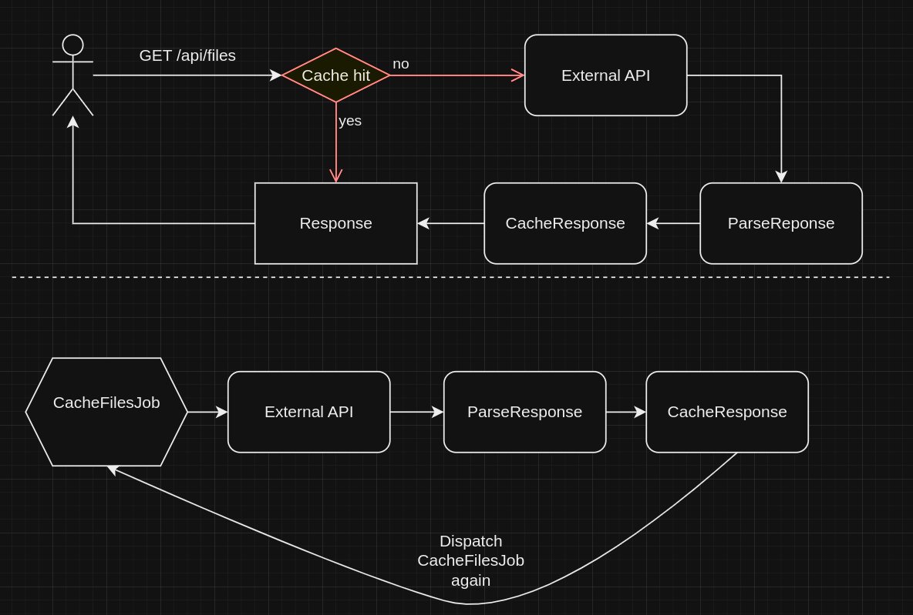

# Bluegrid - Assignment

## Project Setup

- This project is set up with laravel sail:
```bash
./vendor/bin/sail up -d
```

- Command that should be run once on startup to dispatch first caching job:

```bash
./vendor/bin/sail artisan app:run-cache-files-job
```

 - Test can be executed with this command:
```bash
./vendor/bin/sail artisan test
```

- ENV variables to consider changing (they have default values if not set):
```bash
FILES_URL=rest-test-eight.vercel.app/api/test
FILES_CACHE_KEY=files_data
```

- Additional ENV variables (should support redis, and other queue connections):
```bash
QUEUE_CONNECTION 
REDIS_CLIENT
REDIS_HOST
REDIS_PASSWORD
REDIS_PORT
CACHE_STORE
```

## Notes

- On `api/files` route you can expect the response based on requirements.
- Parsed response is cached to ensure the fastest response.
- Since response can take few seconds `CacheFilesJob` dispatches itself as soon is finished. To minimize end user waiting time.
- This way we have most up-to-date and fastest response since it will be always reed from cache, but server resources are more used.

### Flow graph


#### Suggested additions:
- After job fails should be rescheduled again after some time
- Writing additional tests
- Validation of external api response
